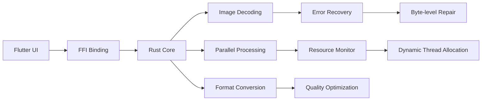

# Flutter + Rust Image Compression Toolkit

### Please note that this is only a test version and is not recommended for use in production environments

## Features

- ⚡ **Multi-threaded batch processing** with dynamic thread pooling
- 📊 **Resource-aware scheduling** based on available memory and CPU cores
- 🔄 **Automatic error recovery** for corrupted image files
- 📈 **Detailed analytics** with compression ratios and space savings
- 🌐 **Cross-platform support** (Android, iOS, Windows, Linux, macOS)


Install Flutter dependencies:
```bash
flutter pub get
```

## Usage

### Basic Compression

```dart
import 'package:image_compressor/api.dart';

void compressSingleImage() async {
  final file = File('/path/to/image.jpg');
  
  final result = await compressSingle(
    filePath: file.path,
    quality: 75,
    format: 'jpeg'
  );

  print('''
  Compression Result:
  Original: ${result.originalSize} bytes
  Compressed: ${result.compressedSize} bytes
  Saved: ${result.originalSize - result.compressedSize} bytes
  ''');
}
```

### Batch Processing

```dart
void processImageBatch() async {
  final images = [
    File('/path/to/image1.jpg'),
    File('/path/to/image2.png'),
    File('/path/to/image3.heic'),
  ];

  final results = await compressBatch(
    filePaths: images.map((f) => f.path).toList(),
    quality: 70,
    format: 'jpeg'
  );

  for (final r in results) {
    if (r.isSuccessful) {
      print('Compressed ${r.result!.originalPath}');
    } else {
      print('Error: ${r.error}');
    }
  }
}
```

### Custom Configuration

```dart
CompressionConfig config = CompressionConfig(
  quality: 85,          // 0-100 (higher = better quality)
  targetSizeKb: 500,     // Optional target file size
  format: ImageFormat.jpg,
  adaptiveSampling: true // Enable smart downscaling
);
```

## System Architecture



### Memory Optimization

For low-memory devices, add to `AndroidManifest.xml`:
```xml
<application
  android:largeHeap="true"
  android:hardwareAccelerated="false">
```

## License

```text
MIT License

Copyright (c) 2023 Your Name

Permission is hereby granted, free of charge, to any person obtaining a copy
of this software and associated documentation files (the "Software"), to deal
in the Software without restriction, including without limitation the rights
to use, copy, modify, merge, publish, distribute, sublicense, and/or sell
copies of the Software, and to permit persons to whom the Software is
furnished to do so, subject to the following conditions:

The above copyright notice and this permission notice shall be included in all
copies or substantial portions of the Software.

THE SOFTWARE IS PROVIDED "AS IS", WITHOUT WARRANTY OF ANY KIND, EXPRESS OR
IMPLIED, INCLUDING BUT NOT LIMITED TO THE WARRANTIES OF MERCHANTABILITY,
FITNESS FOR A PARTICULAR PURPOSE AND NONINFRINGEMENT. IN NO EVENT SHALL THE
AUTHORS OR COPYRIGHT HOLDERS BE LIABLE FOR ANY CLAIM, DAMAGES OR OTHER
LIABILITY, WHETHER IN AN ACTION OF CONTRACT, TORT OR OTHERWISE, ARISING FROM,
OUT OF OR IN CONNECTION WITH THE SOFTWARE OR THE USE OR OTHER DEALINGS IN THE
SOFTWARE.
```

## Roadmap

- [x] Baseline JPEG/PNG compression
- [x] Dynamic resource allocation
- [ ] WebP/AVIF format support (Q3 2025)
- [ ] AI-based compression (Q4 2025)
- [ ] Video compression pipeline (2025)

---